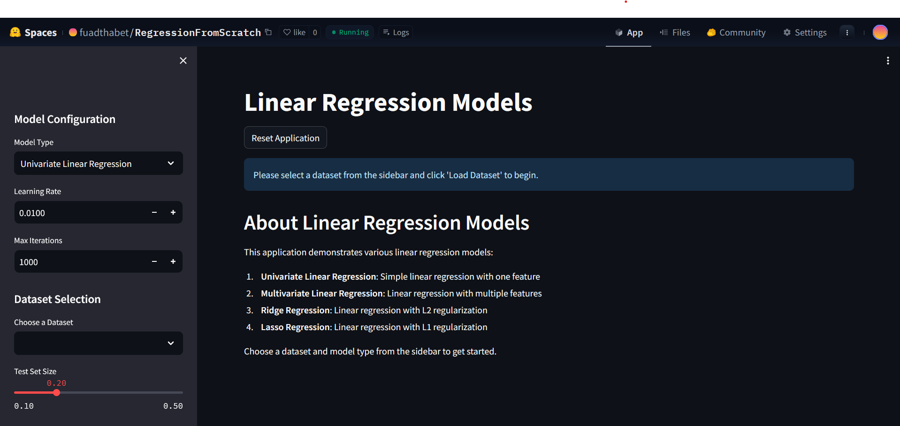

# 🧠 Linear Regression Models from Scratch — Visualized

An interactive Streamlit app that showcases univariate, multivariate, Lasso, and Ridge regression models built entirely from scratch in Python. Visualize model performance, explore cleaned Kaggle datasets, and understand the impact of regularization — all in your browser.

## Interactive Web App

This project is hosted on Hugging Face Spaces. You can access the live application here:

[Linear Regression Models on Hugging Face Spaces](https://huggingface.co/spaces/fuadthabet/RegressionFromScratch)



## Project Overview

This project demonstrates the implementation of various linear regression algorithms from scratch, without relying on scikit-learn or other machine learning libraries. The goal is to provide:

1. Educational resource for understanding regression algorithms
2. Interactive visualization of model performance
3. Clean implementation of optimization algorithms
4. Practical examples of working with real-world datasets

## Data Preprocessing & Cleaning

The project includes both raw and cleaned datasets, with the data cleaning process documented in the notebooks folder:

- `notebooks/01_Data_Exploration.ipynb`: Shows the step-by-step process of cleaning and preprocessing the datasets used in the project

The cleaned datasets are stored in the `datasets/` directory and include:
- Univariate datasets (Single feature):
  - `UnivariateSalaryData.csv`: Employee experience vs. salary
  - `UnivariateIceCreamData.csv`: Temperature vs. ice cream sales
  - `UnivariateStudentData.csv`: Study hours vs. exam score

- Multivariate datasets (Multiple features):
  - `MultivariateHousingData.csv`: Housing price prediction
  - `MultivariateCarPricesData.csv`: Car price prediction
  - `MultivariateStudentData.csv`: Student performance prediction


## Core Models Implemented

All models are implemented from scratch in the `LinearRegression/models/` directory:

1. **Univariate Linear Regression** (`UnivariateLinearModel.py`): 
   - Simple linear regression with one feature
   - Implements closed-form solution and gradient descent

2. **Multivariate Linear Regression** (`MultivariateLinearModel.py`): 
   - Linear regression with multiple features
   - Uses gradient descent for optimization

3. **Ridge Regression** (`RidgeRegression.py`): 
   - Linear regression with L2 regularization
   - Prevents overfitting by penalizing large coefficients

4. **Lasso Regression** (`LassoRegression.py`): 
   - Linear regression with L1 regularization
   - Performs feature selection by shrinking some coefficients to zero


## Optimization Algorithms

The project implements custom optimization algorithms in the `LinearRegression/optimizers/` directory:

1. **Gradient Descent** (`GradientDescent.py`):
   - Batch gradient descent implementation
   - Supports adaptive learning rate
   - Implements early stopping based on convergence

2. **Coordinate Descent** (`CoordinateDescent.py`):
   - Specialized optimization for Lasso regression
   - Updates one coordinate at a time
   - More efficient than gradient descent for L1 regularization

## Data Preprocessing Utilities

The `LinearRegression/preprocessing/` directory contains utilities for data preprocessing:

1. **Feature Normalization** (`Normalization.py`):
   - Standardizes features to have zero mean and unit variance
   - Critical for gradient-based optimization

2. **Data Splitting** (`DataSplitter.py`):
   - Splits data into training and testing sets
   - Preserves feature distributions between sets

## Command-Line Examples

The `examples/` directory contains standalone Python scripts that demonstrate how to use each model from the command line:

- `UnivariateExample.py`: Example of univariate linear regression
- `MultivariateExample.py`: Example of multivariate linear regression
- `RidgeExample.py`: Example of ridge regression
- `LassoExample.py`: Example of lasso regression

To run these examples:

```bash
python examples/UnivariateExample.py
```

## Streamlit Web Application

The project includes a Streamlit web application (`app.py`) that provides an interactive interface for:
- Loading different datasets
- Training different regression models
- Visualizing results and model performance
- Comparing model predictions


### Running Locally

```bash
# Install dependencies
pip install -r requirements.txt

# Run the app
streamlit run app.py
```

### Deployment on Hugging Face Spaces

The `app.py` file is designed to be self-contained for deployment on Hugging Face Spaces. It includes all model implementations directly in the file to avoid import issues in the Hugging Face environment.

## Project Structure

```
.
├── app.py                  # Self-contained Streamlit application
├── LinearRegression/       # Core package with model implementations
│   ├── models/             # Model implementations
│   │   ├── BaseModel.py
│   │   ├── UnivariateLinearModel.py
│   │   ├── MultivariateLinearModel.py
│   │   ├── RidgeRegression.py
│   │   └── LassoRegression.py
│   ├── optimizers/         # Optimization algorithms
│   │   ├── GradientDescent.py
│   │   └── CoordinateDescent.py
│   ├── preprocessing/      # Data preprocessing utilities
│   │   ├── Normalization.py
│   │   └── DataSplitter.py
│   └── utils/              # Utility functions
├── datasets/               # Cleaned datasets
│   ├── UnivariateSalaryData.csv
│   ├── UnivariateIceCreamData.csv
│   ├── UnivariateStudentData.csv
│   ├── MultivariateHousingData.csv
│   ├── MultivariateCarPricesData.csv
│   └── MultivariateStudentData.csv
├── examples/               # Command-line examples
│   ├── UnivariateExample.py
│   ├── MultivariateExample.py
│   ├── RidgeExample.py
│   └── LassoExample.py
├── notebooks/              # Jupyter notebooks for data exploration
│   └── 01_Data_Exploration.ipynb
├── screenshots/            # Screenshots for README
├── requirements.txt        # Project dependencies
└── README.md               # Project documentation
```

## Dependencies

The project requires the following Python packages:
- numpy
- pandas
- matplotlib
- seaborn
- streamlit

All dependencies are listed in `requirements.txt`.